<div align=center></div>  
---

# Android Studio
1. 新建空工程  
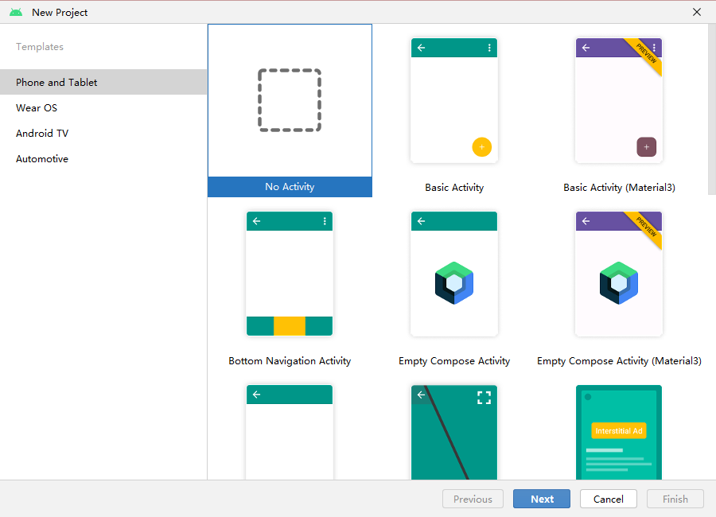
2. 新建模块  
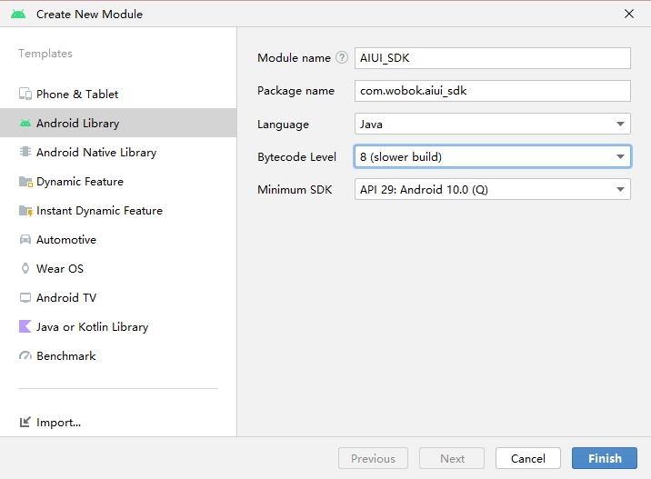
3. 导入AIUI SDK  
[参考文档](https://aiui-doc.xf-yun.com/project-1/doc-2/)  
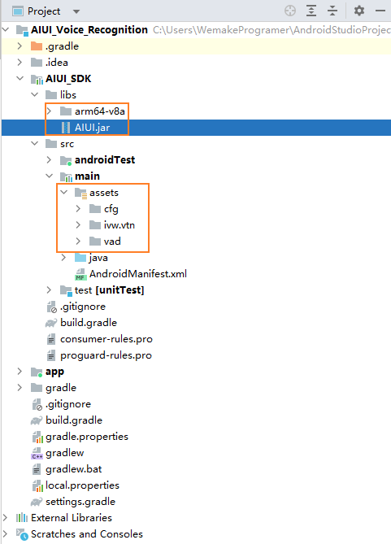  
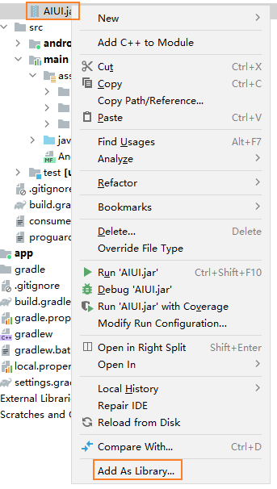  
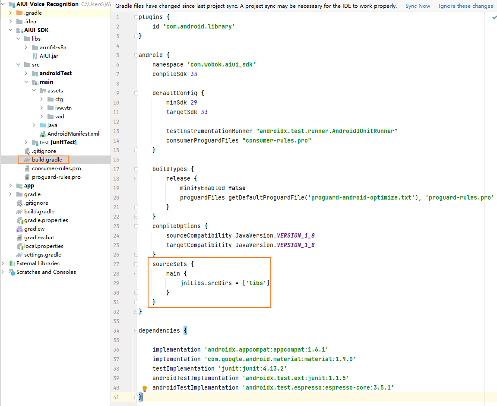  
```
    sourceSets {
        main {
            jniLibs.srcDirs = ['libs']
        }
    }
```
>libs区分CPU架构  
>
>**查看CPU架构**  
>`adb devices` 查看设备是否连接上  
>`adb shell getprop ro.product.cpu.abi` 查看手机的CPU架构类型  
>[参考链接](https://zhuanlan.zhihu.com/p/444118258)  
4. 配置AndroidManifest  
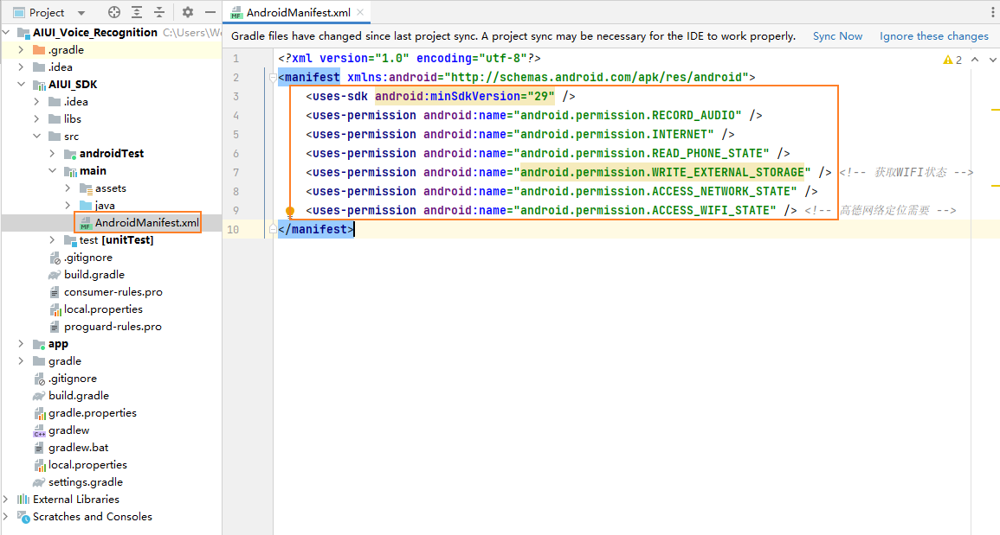
```
    <uses-sdk android:minSdkVersion="29" />
    <uses-permission android:name="android.permission.RECORD_AUDIO" />
    <uses-permission android:name="android.permission.INTERNET" />
    <uses-permission android:name="android.permission.READ_PHONE_STATE" />
    <uses-permission android:name="android.permission.WRITE_EXTERNAL_STORAGE" /> <!-- 获取WIFI状态 -->
    <uses-permission android:name="android.permission.ACCESS_NETWORK_STATE" />
    <uses-permission android:name="android.permission.ACCESS_WIFI_STATE" /> <!-- 高德网络定位需要 -->
```
5. 编写脚本  
[参考文档](https://aiui-doc.xf-yun.com/project-1/doc-2/)  
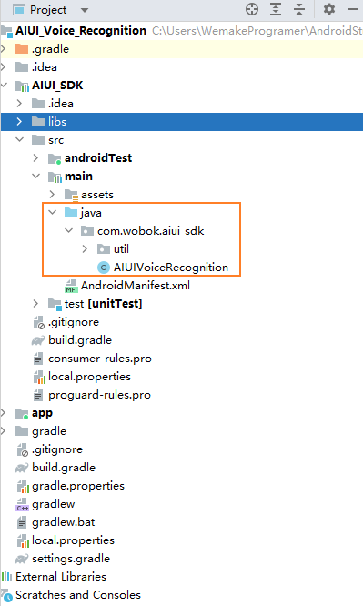  
6. 编译release aar  
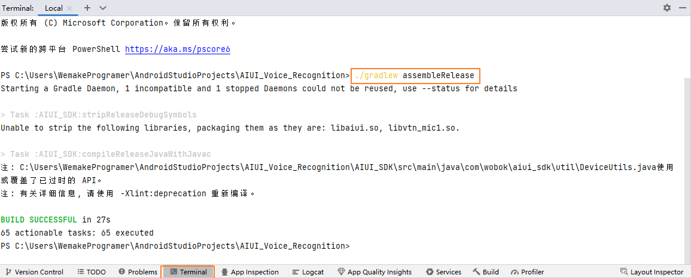  
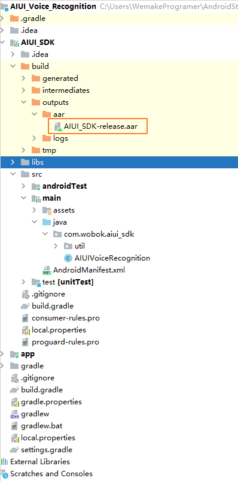
# Unity
1. 将aar导入Unity工程  
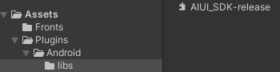
2. 编写脚本  
**[AndroidJavaClass](https://docs.unity3d.com/cn/2021.3/ScriptReference/AndroidJavaClass.html)**：java.lang.Class 的通用实例的Unity表示。  
**[AndroidJavaObject](https://docs.unity3d.com/cn/2021.3/ScriptReference/AndroidJavaObject.html)**： java.lang.Object 的通用实例的Unity表示。  
**[AndroidJavaProxy](https://docs.unity3d.com/cn/2021.3/ScriptReference/AndroidJavaProxy.html)**：此类可用于实现任何Java接口。与代理对象中的接口匹配的任何Java vm方法调用都将自动传递给C#实现。  

e.g.  
```
AndroidJavaObject aiuiInstance;
AndroidJavaClass playerClass = new AndroidJavaClass("com.unity3d.player.UnityPlayer");
AndroidJavaObject activity = playerClass.GetStatic<AndroidJavaObject>("currentActivity");
aiuiInstance = new AndroidJavaObject("com.wobok.aiui_sdk.AIUIVoiceRecognition", activity);
```  
获得Unity Activity实例，构建AIUIVoiceRecognition实例并将Unity Activity传入其构造函数。
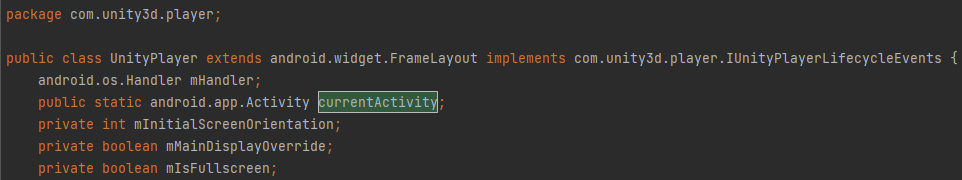
`...\Editor\Data\PlaybackEngines\AndroidPlayer\Variations\mono\Release\Classes\classes.jar`
```
aiuiInstance.Call("CreateAgent");
```
对对象调用 Java 方法。
```
class IRecognitionEvent : AndroidJavaProxy
{
    ···
    public IRecognitionEvent() : base("com.wobok.aiui_sdk.util.EventInterface")
    {

    }
    void OnWakeup()
    {
        ···
    }
}
```
实现Java接口。
